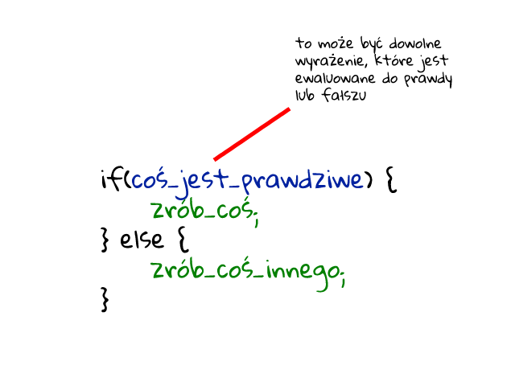

# Instrukcja warunkowa `if...else`

Czasami musimy wykonywać różne działania w zależności od różnych warunków.
W tym celu możemy użyć instrukcji `if...else.`



Instrukcja `if(...)` sprawdza warunek w nawiasach i, jeśli wynik jest prawdziwy,
wykonuje blok kodu.

```js
let year = prompt('In which year was ECMAScript-2015 specification published?', '');

if (year == 2015) alert( 'You are right!' );
```

Instrukcja `if` może zawierać opcjonalny blok `else`.
Wykonuje się, gdy warunek jest fałszywy.

```js
let year = prompt('In which year was the ECMAScript-2015 specification published?', '');

if (year == 2015) {
  alert( 'You guessed it right!' );
} else {
  alert( 'How can you be so wrong?' ); // any value except 2015
}
```

Czasami chcielibyśmy przetestować kilka wariantów stanu.
Klauzula `else...if` pozwala nam to zrobić.

```js
let year = prompt('In which year was the ECMAScript-2015 specification published?', '');

if (year < 2015) {
  alert( 'Too early...' );
} else if (year > 2015) {
  alert( 'Too late' );
} else {
  alert( 'Exactly!' );
}
```

W powyższym kodzie JavaScript najpierw sprawdza rok < 2015. Jeśli jest to `false`,
przechodzi do następnego warunku rok> 2015. Jeśli jest to również `false`,
wyświetla ostatni `alert`. Bloków może być więcej. Ostatnia opcja jest opcjonalna.

Czasami musimy przypisać zmienną w zależności od warunku.

```js
let accessAllowed;
let age = prompt('How old are you?', '');

if (age > 18) {
  accessAllowed = true;
} else {
  accessAllowed = false;
}

alert(accessAllowed);
```

Operator jest reprezentowany przez znak zapytania `?`
Czasami nazywa się „ternary”, ponieważ operator ma trzy operandy.

Składnia tego operatora zapisywana jest w formie:

```js
let result = condition ? value1 : value2;
```

w naszym przypadku:

```js
let accessAllowed = (age > 18) ? true : false;
```

---

- Ćwiczenie 1
Używając `if...else`, napisz kod, który otrzymuje numer za pomocą 
monitu (`prompt()`) następnie wyświetli `alert`:  
- 1, jeśli wartość jest większa od zera,  
- -1, jeśli jest mniejsza niż zero, 
- 0, jeśli jest równa zero. 

W tym zadaniu zakładamy, że dane wejściowe są zawsze liczbą.

---

- Ćwiczenie 2
Przepisz Ćwiczenie1 używając operatora warunkowego `?`.

---

- Ćwiczenie 3

Stwórz trzy zmienne: a = 4, b = 5, c = 6. Za pomocą instrukcji warunkowych sprawdź,
która zmienna jest największa (pomiń wariant kiedy zmienne mogły by być równe).

---

- Ćwiczenie 4

Przepisz poniższy kod, używając instrukcji `switch`:

```js
let a = +prompt('a?', '');

if (a == 0) {
  alert( 0 );
}
if (a == 1) {
  alert( 1 );
}
if (a == 2 || a == 3) {
  alert( '2,3' );
}

```
