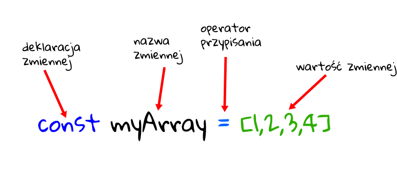

# const



`const` zachowuje się w bardzo podobny sposób do `let`. Ma również zakres blokowy i nie można go używać, dopóki nie zostanie zadeklarowany. Jest jednak jedna kluczowa różnica. Gdy zmienna zadeklarowana za pomocą słowa kluczowego `const` zostanie przypisana wartość, nie można jej ponownie przypisać. Musisz także zainicjować zmienną natychmiast po jej zadeklarowaniu. Jest to przydatne, ponieważ zapobiega to przypadkowemu zmianie przypisania zmiennej. Promuje również dobre praktyki kodowania, ponieważ zabrania używania jednej zmiennej do wielu celów podczas jej cyklu życia, co jest mylące i podatne na błędy.

Chociaż jest to przydatna koncepcja, musisz zdawać sobie sprawę z pewnych ograniczeń. Jedynym ograniczeniem, jakie zapewnia `const`, jest zmiana przypisania. To nie znaczy, że obiekt przypisany do zmiennej `const` nie jest niezmienny! Deklaracja `const` tworzy odwołanie do wartości tylko do odczytu. Nadal możesz zmieniać jego właściwości, usuwać je lub dodawać nowe. Po prostu nie możesz przypisać zupełnie innego obiektu.

Uwaga: dotyczy tylko obiektów. W przypadku prymitywów, takich jak liczby, ciągi znaków lub logiczne, jesteś bezpieczny, ponieważ są one niezmienne.

Podsumowując:

- Nie możemy ponownie przypisać wartości do `const`:

    ```js
    const a = 7;
    a = 5; // Uncaught TypeError: Assignment to constant variable.
    ```

- Nie możemy też ponownie zadeklarować stałej:

    ```js
    const a = 7;
    const a = 5; // Uncaught SyntaxError: Identifier 'a' has already been declared
    ```

## Hoisting `const`

Pamiętajmy, że wynoszona na górę jest tylko deklaracja. A zadeklarowana zmienna (bez przypisania) ma wartość undefined.
