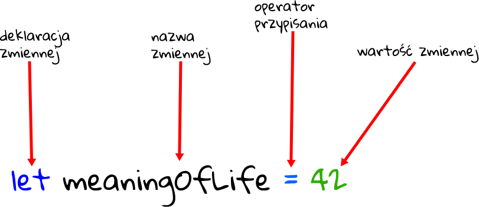

> **let**



`let` pozwala na deklarowanie zmiennych, które są ograniczone do zakresu instrukcji blokowej lub wyrażenia, w którym jest używana, w przeciwieństwie do słowa kluczowego `var`, które definiuje zmienną globalnie lub lokalnie dla całej funkcji, niezależnie od zakresu bloku. Inną różnicą między `var` i `let` jest to, że ta ostatnia jest inicjalizowana na wartość tylko wtedy, gdy parser na to pozwoli. 


Zmienne zadeklarowane przez `let` mają swój zakres w bloku, dla którego są zdefiniowane, a także we wszystkich zawartych podblokach. W ten sposób `let` działa bardzo podobnie do `var`. Główną różnicą jest to, że zakresem zmiennej `var` jest cała obejmująca funkcja:

```
function varTest() {
  var x = 1;
  {
    var x = 2;  // same variable!
    console.log(x);  // 2
  }
  console.log(x);  // 2
}

function letTest() {
  let x = 1;
  {
    let x = 2;  // different variable
    console.log(x);  // 2
  }
  console.log(x);  // 1
}
```

Ponowne zadeklarowanie tej samej zmiennej w ramach tej samej funkcji lub zakresu bloku powoduje błąd `SyntaxError`:

```
if (x) {
  let foo;
  let foo; // SyntaxError thrown.
}

```


`let` nie tworzy właściwości obiektu `window`, gdy jest deklarowany globalnie (w najwyższym zakresie).

```
var x = 'global';
let y = 'global';
console.log(this.x); // "global"
console.log(this.y); // undefined

```


> Hoisting `let`

Pamiętajmy, że wynoszona na górę jest tylko deklaracja. A zadeklarowana zmienna (bez przypisania) ma wartość undefined.