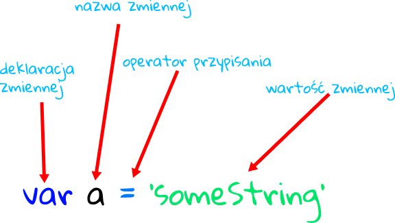

# var



Deklaracje `var`, gdziekolwiek występują, są przetwarzane przed wykonaniem jakiegokolwiek kodu. Nazywa się to podnoszeniem (*hoisting*) i omówimy to zjawisko poniżej.

Zakres zmiennej zadeklarowanej za pomocą `var` jest bieżącym kontekstem wykonania, który jest funkcją zamykającą lub, w przypadku zmiennych zadeklarowanych poza jakąkolwiek funkcją, globalną.

Jeśli ponownie zadeklarujesz zmienną JavaScript, nie straci ona swojej wartości. Przypisanie wartości do niezadeklarowanej zmiennej domyślnie tworzy ją jako zmienną globalną (staje się własnością obiektu globalnego) podczas przypisywania.
Różnice między zmiennymi zadeklarowanymi i niezadeklarowanymi to:

1. Zmienne zadeklarowane są ograniczone w kontekście wykonania, w którym zostały zadeklarowane. Niezadeklarowane zmienne są zawsze globalne.

    ```js
    function x() {
    y = 1; // Throws a ReferenceError in strict mode.
    var z = 2;
    }

    x();

    console.log(y); // 1
    console.log(z); // Throws a ReferenceError: z is not defined outside x.
    ```

2. Zadeklarowane zmienne są tworzone przed wykonaniem jakiegokolwiek kodu.
    Niezadeklarowane zmienne nie istnieją, dopóki nie zostanie do nich przypisany
    kod.

    ```js
    console.log(a);                // "undefined" or "" depending on browser
    console.log('still going...'); // still going...
    var a = 1;
    console.log(a);                // 1
    console.log('still going...'); // still going...
    ```

3. Zadeklarowane zmienne są "nieskonfigurowalną" właściwością kontekstu wykonania
    (funkcji lub globalnego). Niezadeklarowane zmienne można konfigurować
    (np. można je usunąć).

    ```js
    var a = 1;
    b = 2;

    delete this.a; // Throws a TypeError in strict mode. Fails silently otherwise.
    delete this.b;

    console.log(a, b); // Throws a ReferenceError.
    // The 'b' property was deleted and no longer exists.
    ```

Z powodu tych trzech różnic niezadeklarowanie zmiennych najprawdopodobniej doprowadzi do nieoczekiwanych wyników. Dlatego zaleca się, aby zawsze deklarować zmienne, niezależnie od tego, czy mają one funkcję, czy zasięg globalny. W trybie ścisłym (`strict mode`) ECMAScript 5 przypisanie do niezadeklarowanej zmiennej powoduje błąd.

## Hoisting

Ponieważ deklaracje zmiennych (i ogólnie deklaracje) są przetwarzane przed wykonaniem jakiegokolwiek kodu, zadeklarowanie zmiennej w dowolnym miejscu w kodzie jest równoważne zadeklarowaniu jej na górze. Oznacza to również, że zmienna może wydawać się używana, zanim zostanie zadeklarowana. To zachowanie nazywa się „podnoszeniem”, ponieważ wydaje się, że deklaracja zmiennej jest przenoszona na górę funkcji lub do kodu globalnego.

```js
bla = 2;
var bla;

// ...is implicitly understood as:

var bla;
bla = 2;
```

Z tego powodu zaleca się, aby zawsze deklarować zmienne u góry zakresu (u góry kodu globalnego i u góry kodu funkcji), aby było jasne, które zmienne mają zakres funkcji (lokalny), a które są rozwiązywane w łańcuchu zasięgu. Należy zauważyć, że podnoszenie wpłynie na deklarację zmiennej, ale nie na inicjalizację jej wartości. Wartość zostanie rzeczywiście przypisana po osiągnięciu instrukcji przypisania:

```js
function do_something() {
  console.log(bar); // undefined
  var bar = 111;
  console.log(bar); // 111
}

// ...is implicitly understood as:

function do_something() {
  var bar;
  console.log(bar); // undefined
  bar = 111;
  console.log(bar); // 111
}
```

## Źródła

* [Mozilla Developer Network](https://developer.mozilla.org/en-US/docs/Web/JavaScript/Reference/Statements/var)
* [scotch.io](https://scotch.io/courses/10-need-to-know-javascript-concepts/declaring-javascript-variables-var-let-and-const)
