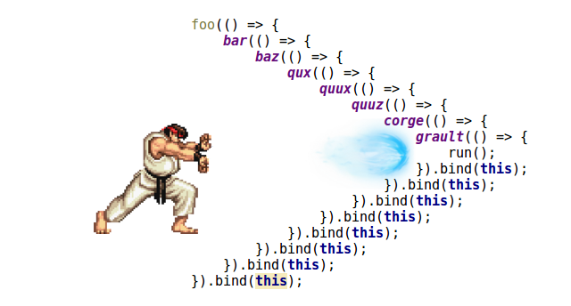

> Funkcja wywołana zwrotnego

W JavaScript funkcje są obiektami. Z tego powodu funkcje mogą przyjmować funkcje jako argumenty i mogą być zwracane przez inne funkcje. Funkcje, które to robią, nazywane są funkcjami wyższego rzędu. Każda funkcja przekazana jako argument nazywa się funkcją wywołania zwrotnego.

Stwórzmy własny przykładowy `callback`:

```
function sumTable(tab, fn) {
    let sum = 0;
    for (let i=0; i<tab.length; i++) {
        sum += tab[i];
    }
    fn(sum);
}

sumTable([1,2,3,4], function(res) {
    console.log('Suma liczb w tablicy to: ' + res);
});
```
Bardzo często callbacki wykorzystuje się do poruszania się po strukturze DOM, o czym niebawem porozmawiamy.


**Callback hell**

Bardzo często, aby sprostać wymaganiom biznesowym, będziemy potrzebowali wielokrotnego zagnieżdżania wywołań zwrotnych. Powstały w ten sposób kod jest trudny w utrzymaniu i mało czytelny. Często zdarza się też, że kolejne funkcje zwrotne porozrzucane są w różnych miejscach kodu czy nawet w różnych plikach, co dodatkowo utrudnia pracę. Tego typu sytuację nazywamy piekłem wywołań zwrotnych (ang. callback hell).

