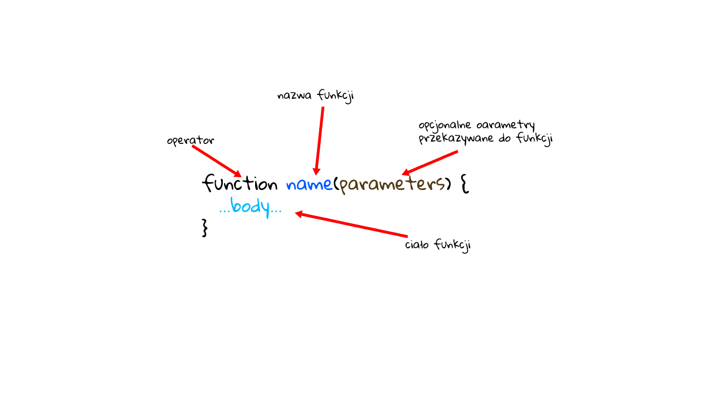

> Funkcje

Dość często musimy wykonać podobną akcję w wielu miejscach skryptu. Na przykład musimy pokazać ładnie wyglądającą wiadomość, gdy użytkownik loguje się, wylogowuje i może gdzie indziej.
Funkcje są głównymi „elementami składowymi” programu. Pozwalają na wielokrotne wywoływanie kodu bez powtórzeń.
Widzieliśmy już przykłady wbudowanych funkcji, takich jak `alert(message)` i `confirm(question)`.
Ale możemy również tworzyć własne funkcje.

**Deklaracja funkcji**
Aby stworzyć funkcję, możemy użyć deklaracji funkcji:



Stwórzmy przykładową funkcję:

```js
function showMessage() {
  alert('Hello everyone!');
}

showMessage();
showMessage();

```

Wywołanie `showMessage()` wykonuje kod funkcji. Tutaj dwa razy zobaczymy wiadomość.
Ten przykład wyraźnie pokazuje jeden z głównych celów funkcji: unikanie powielania kodu.
Jeśli kiedykolwiek będziemy musieli zmienić wiadomość lub sposób jej wyświetlania, wystarczy zmodyfikować kod w jednym miejscu: funkcja, która go wysyła.

**Parametry i argumenty**
- parametry są zmiennymi wymienionymi jako część deklaracji funkcji.
- argumenty są wartościami przekazywanymi do funkcji po jej wywołaniu.

Możemy przekazywać dowolne dane do funkcji za pomocą parametrów. W poniższym przykładzie funkcja ma dwa parametry: `from` i `text`.

```js
function showMessage(from, text) { // arguments: from, text
  alert(from + ': ' + text);
}

showMessage('Ann', 'Hello!'); // Ann: Hello! (*)
showMessage('Ann', "What's up?"); // Ann: What's up? (**)
```

Gdy funkcja jest wywoływana w wierszach (*) i (**), podane wartości są kopiowane do zmiennych lokalnych z i tekstu.
Następnie funkcja ich używa.
Oto jeszcze jeden przykład: mamy zmienną z i przekazujemy ją do funkcji. 
Uwaga: funkcja zmienia się z, ale zmiany nie widać na zewnątrz, ponieważ funkcja zawsze otrzymuje kopię wartości:

```js
function showMessage(from, text) {

  from = '*' + from + '*'; // make "from" look nicer

  alert( from + ': ' + text );
}

let from = "Ann";

showMessage(from, "Hello"); // *Ann*: Hello

// the value of "from" is the same, the function modified a local copy
alert( from ); // Ann

```

**Parametry domyślne**
Jeśli parametr nie zostanie podany, jego wartość stanie się niezdefiniowana. Na przykład wyżej wspomnianą funkcję `showMessage(from, text)` można wywołać za pomocą jednego argumentu:

```js
showMessage("Ann");
```
To nie jest błąd. Takie wywołanie wyświetli `„Ann: undefined”`. Nie ma tekstu, więc przyjęto, że `text` === `undefined`.

Jeśli w tym przypadku chcemy użyć „domyślnej” wartości, możemy ją określić po `=`:

```js
function showMessage(from, text = "default text") {
  alert( from + ": " + text );
}

showMessage("Ann"); // Ann: default text
```

Jeśli parametr tekstowy nie zostanie przekazany, otrzyma wartość `„default text”`

Tutaj `„default text”` jest ciągiem, ale może być bardziej złożonym wyrażeniem, które jest oceniane i przypisywane tylko w przypadku braku parametru. Jest to również możliwe:

```js
function showMessage(from, text = anotherFunction()) {
  // anotherFunction() only executed if no text given
  // its result becomes the value of text
}
```

**Zwracanie wartości**
Funkcja może zwrócić wartość w wyniku jej wywołania.
Najprostszym przykładem może być funkcja sumująca dwie wartości:

```js
function sum(a, b) {
  return a + b;
}

let result = sum(1, 2);
alert( result ); // 3
```

Polecenie `return` może znajdować się w dowolnym miejscu ciała funkcji.
Jeśli w trakcie wykonywania kodu zawartego w ciele funkcji interpreter napotka na `return` natychmiast kończy przetwarzanie kolejnych linii i zwraca to, co jest po `return`.
W jednej funkcji może występować znajdować się wiele wystąpień `return`. Na przykład:

```js
function checkAge(age) {
  if (age > 18) {
    return true;
  } else {
    return confirm('Do you have permission from your parents?');
  }
}

let age = prompt('How old are you?', 18);

if ( checkAge(age) ) {
  alert( 'Access granted' );
} else {
  alert( 'Access denied' );
}
```

Możliwe jest użycie `return` bez wartości. To powoduje, że funkcja natychmiast się kończy.

```js
function showMovie(age) {
  if ( !checkAge(age) ) {
    return;
  }

  alert( "Showing you the movie" ); // (*)
  // ...
}
```
W powyższym kodzie, jeśli `checkAge(age)` zwraca wartość `false`, `showMovie()` nie przejdzie do alertu.

**Ważne wskazówki**
- Funkcja z pustym `return` lub bez niego zwraca wartość `undefined` 

```js
function doNothing() { /* empty */ }

alert( doNothing() === undefined ); // true
```

```js
function doNothing() {
  return;
}

alert( doNothing() === undefined ); // true
```

- Nigdy nie dodawaj nowego wiersza między `return` a wartością

```js
return
 (some + long + expression + or + whatever * f(a) + f(b))
```

```js
return;
 (some + long + expression + or + whatever * f(a) + f(b))
```

Jeśli chcemy, aby zwrócone wyrażenie było zawijane w wielu wierszach, powinniśmy zacząć je od tej samej linii co `return`.
Lub przynajmniej umieść tam nawiasy otwierające w następujący sposób:

```js
return (
  some + long + expression
  + or +
  whatever * f(a) + f(b)
  )
```

- Funkcje to akcje, więc ich nazwa jest zwykle czasownikiem. Powinien być krótki, możliwie jak najdokładniejszy i opisywać, co robi funkcja,
- aby osoba czytająca kod otrzymała informację o tym, co robi funkcja.
- Powszechną praktyką jest uruchamianie funkcji ze słownym przedrostkiem, który niejasno opisuje akcję.

  Nazwy mogą zaczynać się od:
  - `„get…”` - zwraca wartość,
  - `„calc…”` - oblicza coś,
  - `„tworzy…”` - tworzy coś,
  - `„sprawdza…”` - sprawdza coś i zwraca wartość logiczną itp.

 Przykładowe nazwy funkcji:
    - `showMessage(..) `    // pokazuje komunikat
    - `getAge(..)   `       // zwraca wiek
    - `calcSum(..)`         // oblicza sumę i zwraca wynik
    - `createForm(..)`      // tworzy formularz
    - `checkPermission(..)` // sprawdza uprawnienia

Po wprowadzeniu prefiksów rzut oka na nazwę funkcji pozwala zrozumieć, jaki rodzaj pracy wykonuje i jaką wartość zwraca.

- Jedna funkcja, jedna akcja.
Funkcja powinna robić dokładnie to, co sugeruje jej nazwa, nie więcej.

Dwie niezależne akcje zwykle zasługują na dwie funkcje, nawet jeśli zwykle są wywoływane razem (w takim przypadku możemy wykonać trzecią funkcję, która wywołuje te dwie). Kilka przykładów złamania tej reguły: 
- `getAge()` - byłoby źle, gdyby wyświetlał `alert` z wiekiem (powinien się dostać tylko).
- `createForm()` - byłoby źle, gdyby modyfikował dokument, dodając do niego formularz (powinien tylko go utworzyć i zwrócić).
- `checkPermission()` - byłoby złe, gdyby wyświetlał komunikat o przyznaniu / odmowie dostępu (powinien tylko wykonać sprawdzenie i zwrócić wynik).
