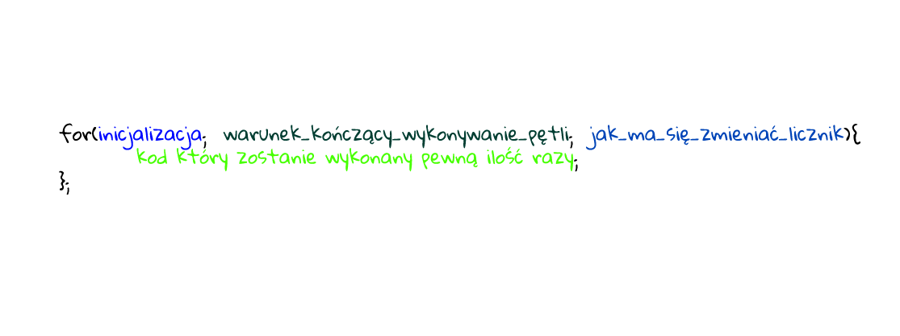

# Pętla `for`

Instrukcja `for` tworzy pętlę, która składa się z trzech opcjonalnych wyrażeń, zamkniętych w nawiasach i oddzielonych średnikami, a następnie instrukcji (zwykle instrukcji blokowej), która ma zostać wykonana w pętli.



## Inicjalizacja

Wyrażenie (w tym wyrażenia przypisania) lub deklaracja zmiennej. Zwykle używany do inicjalizacji zmiennej licznika. To wyrażenie może opcjonalnie zadeklarować nowe zmienne słowami kluczowymi `var` lub `let`. Zmienne zadeklarowane za pomocą `var `nie są lokalne dla pętli, tj. są w tym samym zakresie, w którym znajduje się pętla `for`. Zmienne zadeklarowane za pomocą `let` są lokalne dla instrukcji.


Następująca instrukcja rozpoczyna się od zadeklarowania zmiennej i zainicjowania jej na 0. Sprawdza, czy i jest mniejsza niż sto, wykonuje dwie kolejne instrukcje i zwiększa `i` o 1 po każdym przejściu przez pętlę.

## Warunek kończący pętlę

Wyrażenie do oceny przed każdą iteracją pętli. Jeśli to wyrażenie ma wartość `true`, instrukcja jest wykonywana. Ten test warunkowy jest opcjonalny. Jeśli zostanie pominięty, warunek zawsze będzie miał wartość `true`. Jeśli wyrażenie ma wartość `false`, wykonanie przeskakuje do pierwszego wyrażenia następującego po konstrukcji `for`.

## Jak ma się zmieniać licznik?

Wyrażenie do oceny na końcu każdej iteracji pętli. Dzieje się tak przed kolejną oceną stanu. Ogólnie używany do aktualizacji - zwiększenia lub zmniejszania zmiennej licznika.

```js
for (let i = 0; i < 100; i++) {
    console.log('Warsztaty WarsawJS są świetne!');
}
```
