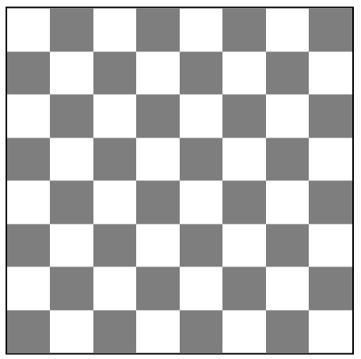
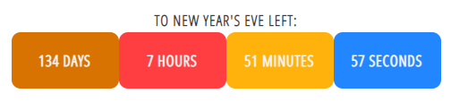

# Document Object Model

Przełącz się na branch 06-dom

- Ćwiczenie 1

Użyj metod manipulowania elementami DOM, aby wypisać dowolny tekst w sekcji

```html
            <section class="sandbox">
                <h4></h4>
```

---

- Ćwiczenie 2

Za pomocą poznanych metod dostępu i pracy z elementami DOM stwórz szachownicę.
Każdy kwadrat składający się na szachownicę powinien być elementem `div`.
Szachownica powinna znaleźć się w kontenerze posiadającym klasę `chessboard`.
Kontener `chessboard` powinien być dzieckiem `main`.
Do wygenerowania elementów `div` będących polami szachownicy wykorzystaj pętlę `for`.



---

- Ćwiczenie 3

Za pomocą poznanych metod dostępu i pracy z elementami DOM stwórz licznik
odliczający czas pozostały do końca roku.
Licznik powinien znajdować się w kontenerze `countdown`.
Nagłówek licznika powinien znaleźć się w klasie css `countdown__header`.


